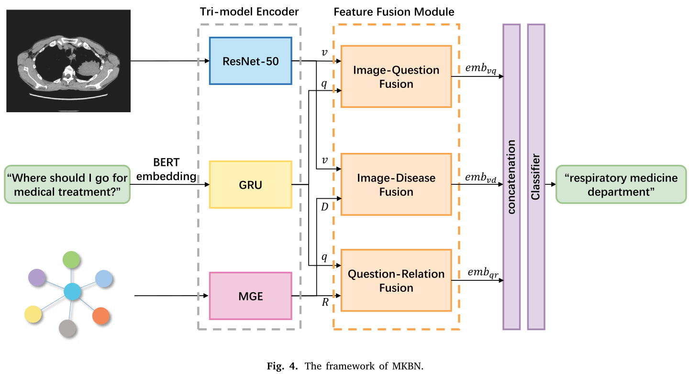
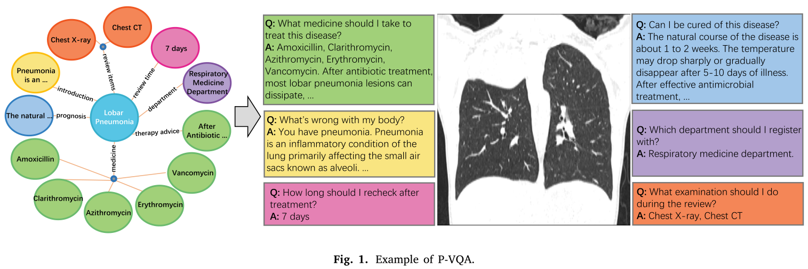

# Medical knowledge-based network for Patient-oriented Visual Question Answering

Dataset and code for the paper [Medical knowledge-based network for Patient-oriented Visual Question Answering](https://www.sciencedirect.com/science/article/abs/pii/S0306457322003429).



## Dataset

You can access P-VQA dataset from [here (code: 249a)](https://pan.baidu.com/s/1aR64hDB0jPpbMO3pphH-sg).

## Evaluation
### Requirements
```
torch==1.11.0
torchvision==0.12.0
torchaudio==0.11.0
scikit-learn
pytorch_pretrained_bert
```
### Prepare data and models
1. Download the pretrained model for medical image and MKBN model here [here (code: 4bjm)](https://pan.baidu.com/s/1WALE9hNVpOIPiBxnQy7QCg).
2. Get the bert embeddings of questions.
    ```
    python util/questions2BertEmb.py
    ```

### Testing
```
python test.py
```

### Training
```
python train.py
```

## Regenerate inital features of knowledge graph
We have provide the inital features of knowledge graph in features/graph_init_features. You can generate a new one by:
```
# Pretrain medical images on train set.
python util/imgCls.py

# Get the disease embeddings from the pretrained image embeddins.
python util/diseaseEmb.py

# Get the attribute and relation embeddings.
python util/attrAndRelGen.py

# Get the edges of tri-entity graph.
python util/edgeGen.py
```

If you use this code or P-VQA dataset, please cite our paper:
```
@article{huang2023medical,
    title={Medical knowledge-based network for Patient-oriented Visual Question Answering},
    author={Huang, Jian and Chen, Yihao and Li, Yong and Yang, Zhenguo and Gong, Xuehao and Wang, Fu Lee and Xu, Xiaohong and Liu, Wenyin},
    journal={Information Processing \& Management},
    volume={60},
    number={2},
    pages={103241},
    year={2023},
    publisher={Elsevier}
}
```